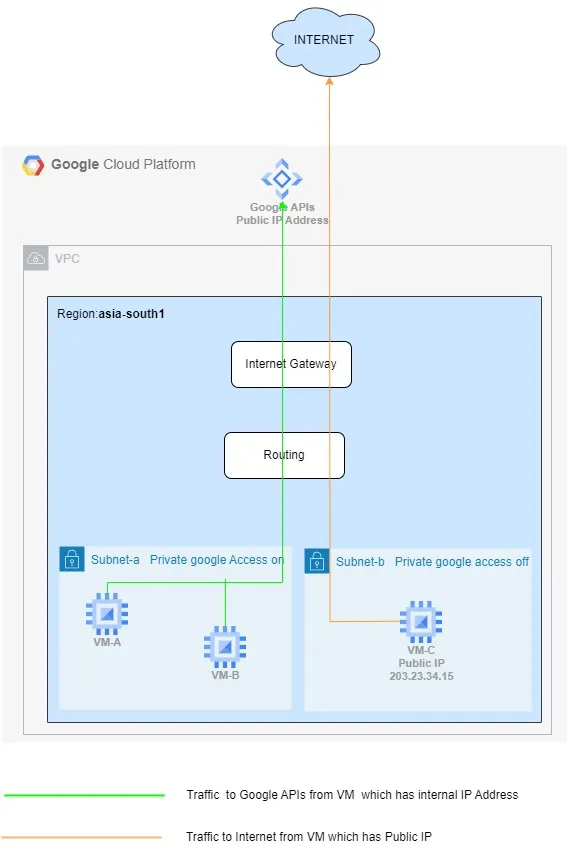

# GCP Private Access

Private Google Access and Private Service Connect are both ways to access Google APIs and services from your VPC network without using an external IP address. However, there are some key differences between the two services.

Let’s say you have a VPC network that contains a set of VM instances that need to access Google Cloud Storage. You could use **Private Google Access** to access Cloud Storage without using an external IP address. However, if you want to use your own internal IP addresses for Cloud Storage, you would need to use **Private Service Connect**.

```shell
The key difference is that Private google access uses a shared set of IP addresses, basically connecting to some shared set of IP addresses and these sets of IPs are the ranges defined for all the Google APIs where in the private service connect, you create the Private endpoint to connect to the Google APIs using the internal IP. Which means you don’t need to connect to certain set or ranges of IP.
```


## Private Google Access
<p align="center">

</p>

The VPC network is connected to a shared set of IP addresses that are used to access Google APIs and services. This means that all traffic from the VPC network to Google APIs and services will go through the same set of IP addresses.

When a VM in a subnet with Private Google Access tries to connect to a Google API or service, the traffic will be routed to the default internet gateway. However, the default internet gateway will not forward the traffic to the Google API or service. Instead, the traffic will be routed to the Private Google Access proxy. The Private Google Access proxy will then forward the traffic to the Google API or service. This ensures that the traffic is not exposed to the internet, which improves security.

* **Uses a shared set of IP addresses.** When you use Private Google Access, your VPC network is connected to a shared set of IP addresses that are used to access Google APIs and services. This means that all traffic from your VPC network to Google APIs and services will go through the same set of IP addresses.
* **Is not as flexible. Private** Google Access is not as flexible as Private Service Connect. For example, you cannot use your own internal IP addresses with Private Google Access.
* **Is easier to set up.** Private Google Access is easier to set up than Private Service Connect. You do not need to create any custom resources, and you can use the same configuration for all of your Google APIs and services.

### How to setup Private Google Access
Private Google Access (PGA) enables users to access the Google APIs privately and securely within the google network, without routing to the internet. It exposes a specific set of IP addrress ranges as published in the [documentation](https://cloud.google.com/vpc/docs/configure-private-google-access#dns-config-google-apis) to which we can route the Google APIS by creating DNS specific entries.

<p align="center">

</p>

```shell
curl -H "Authorization: Bearer $(gcloud auth application-default print-access-token)" https://storage.googleapis.com/storage/v1/b?project=gcp-test
```
The above curl command should be routed via PGA IP address range once its configured. You can verify this with traceroute storage.googleapis.com and it should print one of the 4 IP address range that is configured in Cloud DNS for PGA

## Private Service Connect
<p align="center">

</p>

The VPC network is connected to a Google Cloud service called a Private Service Connect endpoint. This endpoint is configured to use your own internal IP addresses. Traffic from the VPC network to the Private Service Connect endpoint will be routed to Google APIs and services using your own internal IP addresses. The VM instances in the VPC network can access Google APIs and services by using their internal IP addresses. This means that they do not need to have an external IP address assigned to them.

* **Uses your own IP addresses.** When you use Private Service Connect, you can use your own internal IP addresses to access Google APIs and services. This gives you more control over your network traffic, and it can improve performance.
* **Is more flexible.** Private Service Connect is more flexible than Private Google Access. You can create custom endpoints for specific Google APIs and services, and you can control how traffic is routed between your VPC network and Google.
* **Is more complex to set up.** Private Service Connect is more complex to set up than Private Google Access. You need to create custom resources, and you need to configure your network to route traffic to the correct endpoints.

### How to setup Private Service Connect
SSH to the VM
```shell
# Access the below cloud storage api via CURL
curl -H "Authorization: Bearer $(gcloud auth application-default print-access-token)" https://storage.googleapis.com/storage/v1/b?project=gcp-test
```

<p align="center">

</p>

The above trace route shows that it traverses via Internet.
Now configure Private Service Connect(PSC) Endpoint to route the traffice internally. 

<p align="center">

</p>

**Use p.googleapis.com DNS names**

When you create an endpoint, Service Directory creates DNS records for commonly used APIs and services that are available using the endpoint. DNS records are created only for APIs and services that have default DNS names that end with googleapis.com, and only for a subset of those APIs and services.

The DNS records are created in a p.googleapis.com private zone. The records point to the endpoint IP address, and use this format: SERVICE-ENDPOINT.p.googleapis.com

For example, if your endpoint name is xyz, DNS records are created for storage-xyz.p.googleapis.com, compute-xyz.p.googleapis.com, and other supported APIs.

<p align="center">

</p>

**Access Cloud-Storage via PSC**

If the Cloud DNS entry does not exist or if you want to use an API from from googleapis.com, then perform below steps

1. Create a DNS zone for the domain you need to use (for example, googleapis.com or gcr.io). 
2. Create an A record for the domain (zone) name itself; for example, googleapis.com or gcr.io. Point this A record to the IP address of the endpoint. 
3. Create a CNAME record for all of the additional domain's possible host names by using an asterisk and a dot followed by the domain (zone) name; for example, *.googleapis.com or *.gcr.io. Point this CNAME record to the A record in the same zone. For example, point *.googleapis.com to googleapis.com or point *.gcr.io to gcr.io.

<p align="center">

</p>

```shell
# ssh to cloud instance
curl -H "Authorization: Bearer $(gcloud auth application-default print-access-token)" https://<service_name>-<psc_endpointname>.p.googleapis.com/storage/v1/b?project=<project_id>

# Example
curl -H "Authorization: Bearer $(gcloud auth application-default print-access-token)" https://storage-pscendpoint.p.googleapis.com/storage/v1/b?project=gcp-test
```

# References
* [Private Access Options for Services in GCP](https://medium.com/google-cloud/private-access-options-for-services-in-gcp-7d5c8b298817)
* [GOOGLE PSC: Access Google APIs through endpoint](https://cloud.google.com/vpc/docs/configure-private-service-connect-apis)
* [GOOGLE PGA: Access Google APIs through PGA](https://cloud.google.com/vpc/docs/configure-private-google-access#config-domain)
* [Cross-Project Cloud SQL Connection with Private Service Connect](https://medium.com/@oredata-engineering/cross-project-cloud-sql-connection-with-private-service-connect-and-terraform-8310e0678554)