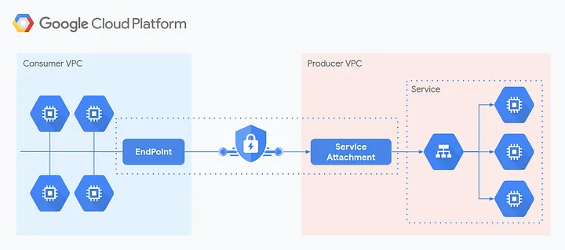

## PSC architecture

The simplest form of PSC is pretty straightforward. There is a service offered from a producer VPC, and a consumer VPC which will consume the service. The producer creates a service attachment to expose the service, and the consumer creates an endpoint targeting this attachment.

